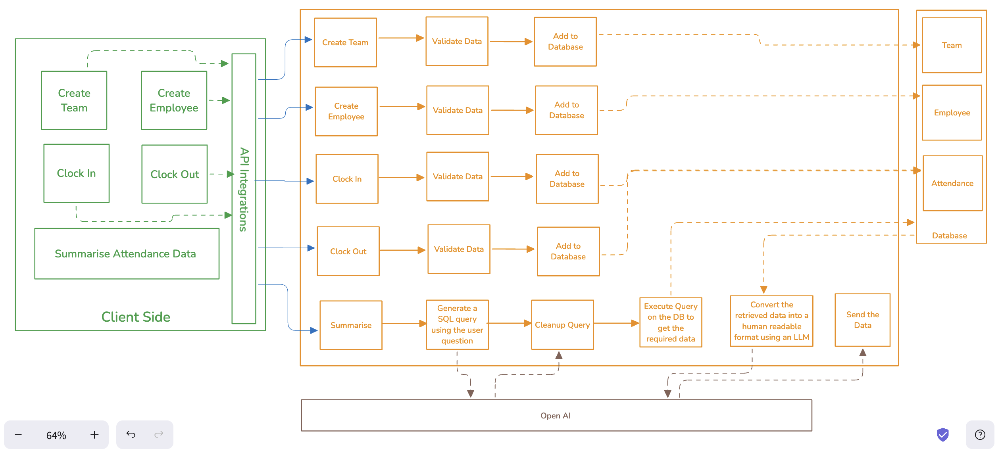

# AI Enhanced Attendance Operations Platform

### Architecture Diagram

### Technologies Used
1. Flask
2. PostgreSQL
3. Open AI (GPT-4o)
4. Docker
5. Render - Deployment (Non-dockerised version)
6. Excalidraw - Diagramming
7. Locust

### Task Details

The task was to build an AI-Enhanced Attendance Operations platform, that has the following features:
1. Fetching Attendance
2. Adding attendance and required entities.
3. Aggregating attendance trends by Employee and Team.
4. Store data in Postgres, with an Optimal schema.
5. Add retry logic and graceful error handling for all API failures.
6. Simulate load using locust
7. Containerize using Docker
8. Summarise daily and weekly attendance logs in natural language.
9. Allow question answers.

### AI Assistance Used

I used AI assistance (Copilot) for the following tasks

1. Create Team and Create Employee APIs: Both APIs were simple Create operations with no complex logic involved
2. Writing the model code: I created the db schema myself and then prompted the copilot to generate code for that schema.
3. Writing load testing logic.
4. Writing request validators based on the schema.
5. Writing response cleanup functions.

### Flow Explanation

In order to build an AI Enhanced Attendance Operations Platform, the first thought that came to my mind was data storage, like where will we store the data, which was followed by the following thoughts:

1. How will we store the data, the answer to which is the database schema, which I created as follows:
<ul>
<li>

### Team Table
| Column Name | Data Type    | Constraints                     |
|------------|-------------|--------------------------------|
| id         | Integer     | Primary Key                   |
| team_name  | String(100) | Not Null                      |

### Employee Table
| Column Name | Data Type    | Constraints                     |
|------------|-------------|--------------------------------|
| id         | Integer     | Primary Key                   |
| name       | String(100) | Not Null                      |
| role       | String(50)  | Not Null                      |
| team_id    | Integer     | Foreign Key (references Team.id), Not Null |
| is_manager | Boolean     | Default: False    

### Attendance Table
| Column Name    | Data Type     | Constraints                     |
|---------------|--------------|--------------------------------|
| id            | Integer      | Primary Key                   |
| date          | Date         | Not Null                      |
| clock_in_time | Time         | Not Null                      |
| clock_out_time| Time         | Nullable                      |
| employee_id   | Integer      | Foreign Key (references Employee.id), Not Null |
| work_mode     | String(10)   | Not Null ('WFH' or 'WFO')     |

</li>
</ul>

2. After the schema got ready, the database connection was required. So, I setup a dockerized Postgres database along with the FLask application for quick database connections and testing. The dockerized setup I replaced later on with a free database that I setup on Render.

3. After database connections, the next goal is to collect and save data. For which, I created APIs for clocking in and clocking out. Further using a script I created some rows in the databse and tested the APIs, which worked fine.

4. Scripts can't be the optimal solution, so I just used copliot to create APIs for team and employee creation.

5. Now, the logic for recording attendance, creating teams and employees was ready.

6. Now, the AI layer has to come as we need to analyse the attendance data and answer queries that are in natural language and present the data in a human readable format, so for that the process looks like following

    <ol>
    <li>
    First thing is to understand the user query and get the data accordingly and since the data is stored in a PostgreSQL database, the way to get the data is to fire a SQL query. To create this feature, we would use an LLM to understand the query and generate a SQL query based on the schema of the database given to it.
    </li>
    <li>
    Secondly, the generated SQL query needs to be executed on the database
    </li>
    <li>
    Once the query data is retrived, it is in JSON format, so we need to convert it to a human readable format as per the user has asked. So, one more LLM implementation, where we pass the data and ask the LLM to a human readable format.
    </li>
    </ol>

Finally, once the logic was all baked, I used retool to build the UI and reployed the backend on a free Render service. Then, I integrated the APIs with the retool UI.